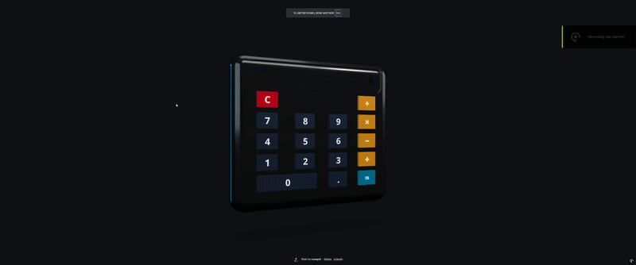

# Three.js Calculator

An interactive 3D calculator built with React, TypeScript, Vite, Tailwind CSS, and Three.js.

The app renders a calculator as a manipulable 3D model with clickable buttons, animated hover/press feedback, and a calculator-style display.

## Demo

Add a demo GIF here once it is ready:

```md

```

Recommended option: place the GIF in `public/demo.gif` and commit it with the repo. That keeps the README self-contained and works reliably on GitHub.

If the GIF is large, upload it to a GitHub issue, pull request, or release, then copy the generated asset URL into the README instead. GitHub is usually better than linking to random external image hosts because the asset stays tied to the project.

## Features

- Interactive 3D calculator model
- Clickable 3D buttons
- Hover glow and press feedback
- Green LCD-style display
- Basic arithmetic operations
- Responsive full-screen canvas
- Built with React Three Fiber and Drei

## Tech Stack

- React
- TypeScript
- Vite
- Three.js
- React Three Fiber
- Drei
- Tailwind CSS
- shadcn/ui

## Getting Started

Install dependencies:

```sh
npm install
```

Run the development server:

```sh
npm run dev
```

Build for production:

```sh
npm run build
```

Preview the production build:

```sh
npm run preview
```

## Project Structure

```txt
src/
  components/
    Calculator3D.tsx
    calculator/
      CalculatorBody.tsx
      CalculatorButton.tsx
      CalculatorDisplay.tsx
  hooks/
    useCalculator.ts
  pages/
    Index.tsx
```

## Notes

The calculator currently supports basic arithmetic. Future improvements could include keyboard input, backspace, percentage support, better mobile controls, and unit tests for calculator behavior.

## License

MIT
